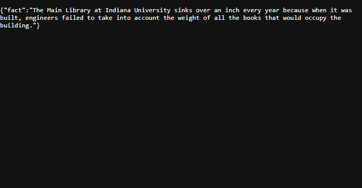

# Lab 12.2: Server to Server Communication

[Karl Johnson](https://github.com/hirekarl)  
2025-RTT-30  
<time datetime="2025-08-14">2025-08-14</time>  



## Overview
### Viewer Instructions
1. Run the following in the terminal:

```bash
npm i && npm run dev
```

2. Navigate to http://localhost:3000/api/fun-fact in the browser.


### Submission Source
Top-level application behavior can be found in [`./server.js`](./server.js).


### Reflection
1. Why was it important to re-format the data from the Useless Facts API before sending it to your own client? What are the benefits of an API providing a clean, minimal response?
> The end user doesn't need any of the other information supplied by the API, like the `id` of the fun fact or the `source`. Presumably, they just want the text, and a key like `fact` is more useful for their purposes than `text`, which is more useful for us as the developers, because it differentiates the text of the fact from the rest of its metadata.

2. In the `catch` block, why is it better to send a generic error message to the client instead of the actual error object from `axios`?
> The client doesn't need to know the details of the error, only that their request can't be fulfilled. In some cases, exposing server error details to end users can reveal the structure or implementation of the server and its vulnerabilities; keeping error messages generic can mitigate risks associated with that kind of exposure.

3. How might you modify this application to get a fact in a different language if the external API supported it (e.g., with a query parameter like `?language=de`)?
> [The API does indeed support random fun facts in German](https://uselessfacts.jsph.pl/). The query string `?language=de` simply needs to be appended to the end of the endpoint URL.

## Assignment
The owner of “The Daily Grind” coffee shop was so impressed with your first server that they have a new request. They want to add a “Fun Fact of the Day” to a digital screen in their shop. To do this, they need an API endpoint on their server that fetches a random fun fact from an external public API and provides it in a simple format.
